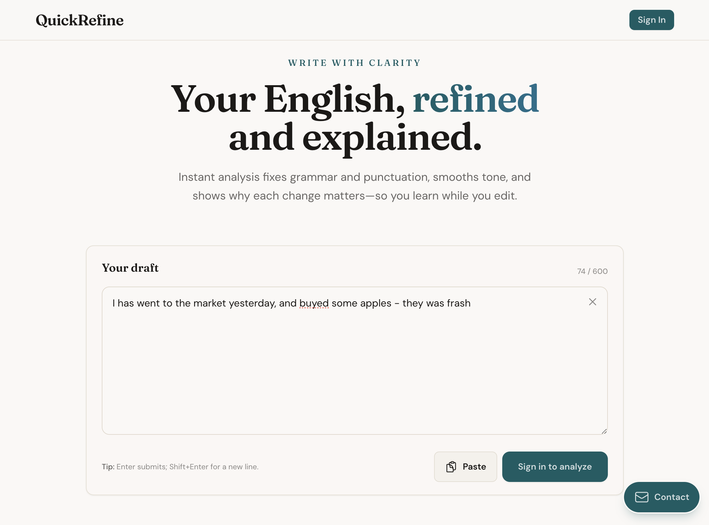

# QuickRefine

AI-assisted English proofreading: grammar and punctuation fixes, tone smoothing, and **explanations** for each change so you learn while you edit.

**Live site:** [quickrefine.com](https://quickrefine.com) · **Repo:** [github.com/mishamoix/QuickRefine](https://github.com/mishamoix/QuickRefine)

---

## Screenshots



The app centers on a **Your draft** editor (up to 600 characters), **How it works**, and **Why writers use it** sections, with Google sign-in for analysis.

---

## Features

- **Structured feedback** — Corrections with short explanations, rules, and examples (via `generateObject` + Zod schemas).
- **Provider choice** — Switch between **Anthropic**, **OpenAI**, or **OpenRouter** using `LLM_PROVIDER` and the matching API keys.
- **Modes** — Standard enhance and a **fast** path for quicker edits.
- **Auth** — NextAuth with Google OAuth; MongoDB adapter for session persistence.
- **Observability** — Optional [Langfuse](https://langfuse.com) tracing for prompt and usage visibility.

---

## Tech stack

| Layer | Tools |
| --- | --- |
| Framework | [Next.js 16](https://nextjs.org) (App Router) |
| UI | React 19, [Tailwind CSS](https://tailwindcss.com), [DaisyUI](https://daisyui.com) |
| AI | [AI SDK](https://sdk.vercel.ai) (`@ai-sdk/openai`, `@ai-sdk/anthropic`) |
| DB | `mongodb` / `mongoose`, `@next-auth/mongodb-adapter` |
| Auth | [NextAuth.js](https://next-auth.js.org) |

---

## Getting started

### Prerequisites

- Node.js 20+ (recommended)
- MongoDB URI (Atlas or local)
- API keys for at least one LLM provider you plan to use
- (Optional) Google OAuth client ID and secret for sign-in

### Setup

```bash
git clone <your-fork-or-repo-url>
cd fix_english
npm install
cp .env.example .env
```

Edit `.env` and set:

- `MONGODB_URI` — database connection string
- `NEXTAUTH_SECRET` — random string (e.g. `openssl rand -base64 32`)
- `NEXTAUTH_URL` — e.g. `http://localhost:3000` in development
- `GOOGLE_ID` / `GOOGLE_SECRET` — from [Google Cloud Console](https://console.cloud.google.com/) OAuth credentials
- `LLM_PROVIDER` — `anthropic` | `openai` | `openrouter`
- One or more of: `LLM_API_KEY`, `ANTHROPIC_API_KEY`, `OPENROUTER_API_KEY` (see `src/libs/llm.ts` for which key each provider uses)
- (Optional) Langfuse keys and `LANGFUSE_HOST` if you use tracing

### Run locally

```bash
npm run dev
```

Open [http://localhost:3000](http://localhost:3000).

### Other commands

```bash
npm run build   # production build
npm run start   # run production server (after build)
npm run lint    # ESLint
```

---

## Project layout (high level)

- `src/app/` — App Router routes, metadata, OG images, API routes (`/api/enhance`, `/api/enhance/fast`, `/api/auth/[...nextauth]`)
- `src/components/` — Landing sections (`Hero`, `TextAnalyzer`, `HowItWorks`, `Features`, …)
- `src/libs/` — LLM client, MongoDB, NextAuth, Langfuse

---

## Support

Questions or feedback: [quickrefine@bizarrefusion.com](mailto:quickrefine@bizarrefusion.com)
